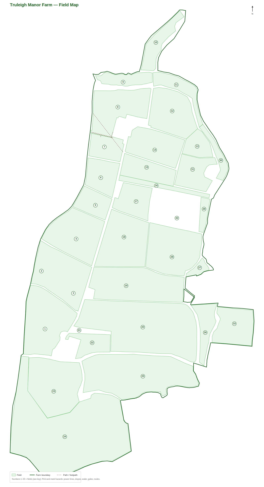

# Module 16 — Farm Map & Field Names

*Knowing where you are, what the field is called, and where the hazards are is part of working
safely. This map is also your **induction markup exercise** (Module 01) — print it and mark the
hazards on it with your supervisor.*

---

## Truleigh Manor Farm — field map



*Numbers 1–33 are the fields (see the key below). The bold line is the farm boundary; dashed lines
are paths/footpaths. A full-resolution vector version for printing is at
[`Farm-Map/truleigh-manor-farm-map.svg`](Farm-Map/truleigh-manor-farm-map.svg). The original source
map is [`Farm-Map/Truleigh_Manor_Farm_Field_Maps.kml`](Farm-Map/Truleigh_Manor_Farm_Field_Maps.kml)
(open in Google Earth).*

---

## Field names key

| # | Field | # | Field | # | Field |
|---|---|---|---|---|---|
| 1 | Hither Cowfield | 12 | North East Sands | 23 | West Lane |
| 2 | East Cowfield | 13 | Sands Hill | 24 | The Hill |
| 3 | West Cowfield | 14 | The Sands | 25 | East Lane |
| 4 | The Fletchetts | 15 | Wood Field | 26 | Browns Meadow |
| 5 | South Flacketts | 16 | Airstrip | 27 | OX Pasture |
| 6 | North Flacketts | 17 | Nine Acre | 28 | The Crofts |
| 7 | West Sands | 18 | East Wood | 29 | Airstrip Meadow |
| 8 | Banky Sands | 19 | Wingfield | 30 | The Brooks |
| 9 | West Meadow | 20 | Gratlands | 31 | North Furze Wood |
| 10 | The Lakes | 21 | Gratlands Paddocks | 32 | South Furze Wood |
| 11 | East Meadow | 22 | Garden Paddock | 33 | Williams |

> Use field names/numbers on the radio/phone so everyone knows exactly where you are — vital if you
> ever need to direct help to you (Module 09).

---

## Markup exercise — do this at induction (with your supervisor)

Print the map (or the SVG) and **mark on it**, walking the farm where you can:

- [ ] **Overhead power lines** and their routes — and any low ones. *(Critical for telehandler,
  rake-folding and tipping work — Modules 04, 08.)*
- [ ] **Steep slopes / banky ground** where tractors and loaded trailers could overturn
  (e.g. around Sands Hill, The Hill, Banky Sands).
- [ ] **Water** — The Lakes, The Brooks, ponds, ditches and any sand/coastal water features.
- [ ] **Soft / boggy ground** that could bog or tip a machine.
- [ ] **Fragile-roof buildings** and structures **never to climb on** (Module 08).
- [ ] **No-go areas** — slurry stores, tanks, pits, grain stores / confined spaces (Module 08).
- [ ] **Main gateways and pinch points** (narrow gates — mind machine width; note the 10 ft & 12 ft
  gates) and the **public footpath** (members of the public about — Module 08).
- [ ] The **hay/haylage route** from field → yard → stack, and where bales are stacked.
- [ ] The **fuel/chemical store**.
- [ ] The **assembly point**, **first aid kit** and **fire extinguisher** locations.
- [ ] The **two emergency locations** for 999 (see card below): **farm entrance** and **Truleigh
  Sands**.

Keep the marked-up copy with this pack and review it if anything changes.

---

## Emergency locations (for 999 / what3words)

| Place | what3words | Link |
|---|---|---|
| **Farm entrance** | `///chicken.airless.hazy` | https://w3w.co/chicken.airless.hazy |
| **Truleigh Sands** | `///playback.poker.touched` | https://w3w.co/playback.poker.touched |

Full emergency details are on the [Emergency Information Card](EMERGENCY-INFORMATION-CARD.md) — print
it and keep it in the cab.

---

## Regenerating the map

If field boundaries change, update the KML and re-run:

```
python3 tools/render_farm_map.py
```

This rewrites `Farm-Map/truleigh-manor-farm-map.svg` and `.png`.
