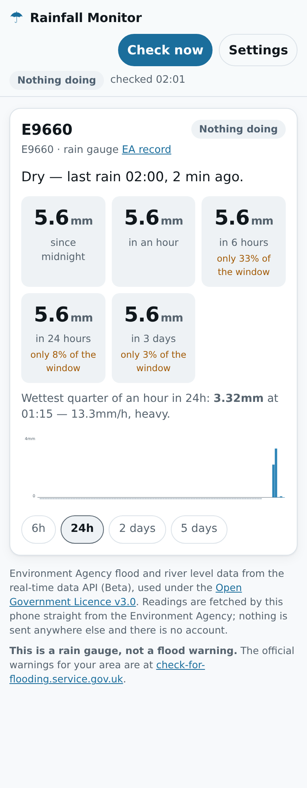
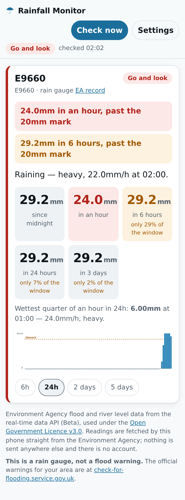

# Rainfall Monitor

How much rain has actually fallen on your gauge, in the last hour, the last six,
the last day and the last three days — with your own marks for when it is worth
walking out to look at the gateway and the ditch.

It runs in a web browser and installs to a phone home screen. The readings come
from the Environment Agency's real-time API, fetched by the phone itself. There
is no server, no account, and nothing about which gauges you watch leaves the
device.

**[Open the app](https://hoganben04.github.io/Planning/rainfall/)** — then see
*Putting it on your phone* below.

<p>
  
  
</p>

## Why it exists

This is the reading it was built around — Environment Agency gauge E9660, the
early hours of 31 August 2026:

| Time | mm in 15 min | Rate |
|---|---|---|
| 00:00 | 2.23 | 8.9 mm/h |
| 00:15 | **3.32** | **13.3 mm/h** |
| 00:30 | 0.02 | — |
| 00:45 | 0.07 | — |
| 01:00 | 0.01 | — |

5.65mm in total, 98% of it in the first half hour, and then it stopped dead. To
get that out of the API you have to notice that the values are 15-minute
accumulations rather than rates, add them up, and spot that the burst is sitting
right against midnight — so the obvious `?today` query has cut the storm in half
and thrown away the earlier part. All three of those are easy to get wrong once
and then never think about again.

The app does that arithmetic, keeps the awkward bits straight, and says what the
numbers mean. Those exact readings are pinned as a test fixture, so the totals
above are what the code is checked against.

## What it does

- **Rolling totals, not calendar ones.** Last hour, last 6 hours, last 24 hours,
  last 3 days, all measured backwards from now. Midnight is not a meaningful
  boundary for weather, and a burst that straddles it must not be cut in two.
  There is a "since midnight" figure as well, worked out in *local* time, because
  that is the number people actually say out loud.
- **Your own marks.** Two per window: *worth watching*, and *go and look*. The
  card turns amber or red and says which window went and by what mark — "24.0mm
  in an hour, past the 20mm mark" — because a bare warning light is not
  actionable.
- **It says when it does not know.** Every total carries how much of its window
  had readings in it. A six-hour total built from one hour of data is labelled
  *only 17% of the window*, and a gauge that has stopped reporting raises its own
  warning. A gauge going quiet looks exactly like a dry night otherwise, and that
  is the one failure worth designing against.
- **A chart with the gaps drawn in.** A bar per 15 minutes, with missing periods
  marked as a grey strip under the baseline rather than left blank — blank looks
  identical to dry. 6 hours, 24 hours, 2 days or 5 days.
- **Intensity as well as amount.** The wettest quarter of an hour in the last day,
  converted to the hourly rate it implies, and described in words: light,
  moderate, heavy, torrential.
- **River levels too.** Add a level station and it shows the height, which way it
  is going and how fast, against the station's own published normal range. A
  river coming up more than 0.25m an hour warns on its own, before any mark is
  set.
- **It works with no signal.** The last readings are kept on the phone and shown
  with their age on the front of the card, so opening it in a yard on one bar
  answers the question instead of spinning.

## The thresholds are not official, and that matters

The starting numbers — 10/20mm in an hour, 20/40mm in six, 30/60mm in a day,
50/90mm in three — are this app's own. They are not an Environment Agency
trigger and not a Met Office warning level. They are round numbers picked to be
low enough to be worth a look and high enough not to cry wolf.

Whether a total actually causes trouble depends on things no rain gauge knows:
how wet the ground already is, how steep it is, what is growing on it, where the
drains and ditches run. 30mm on baked summer ground runs straight off the
surface; the same 30mm in February on ground already at field capacity does
something else entirely. That is why the 3-day window is there — it is the one
that catches the winter flood that "came out of nowhere".

So treat a warning as *go and look*, never as *this will flood*, and edit the
numbers in Settings as you learn what your own ground does. They are saved on the
phone.

**The official flood warnings are at
[check-for-flooding.service.gov.uk](https://check-for-flooding.service.gov.uk/).**
This app is a rain gauge. It knows nothing about a river rising somewhere
upstream of you, and it is not a substitute for the people who do.

## Adding your own gauges

A station id is all it needs — `E9660`, `52203`, `L2404`. Two things to know:

- **Rain gauges have no names.** The Environment Agency withholds them, and
  rounds the position to a 100m grid, on purpose: *"for information protection
  reasons the rainfall monitoring stations do not have names and their geographic
  location has been reduced to a 100m grid."* So a rain gauge arrives as a bare
  id and you give it a name yourself — "Top field", "Yard" — which the app
  remembers. River level stations do have names, and it fills those in for you.
- **To find the gauges near you**, ask the API for stations within a radius. In a
  browser:

  ```
  https://environment.data.gov.uk/flood-monitoring/id/stations?parameter=rainfall&lat=50.88&long=-0.31&dist=10
  ```

  `dist` is in kilometres. Swap `parameter=rainfall` for `parameter=level` to find
  river level gauges instead. The `notation` field in each result is the id to
  type in. There is also the EA's own
  [rainfall demonstrator](https://environment.data.gov.uk/flood-monitoring/assets/demo/index.html)
  if you would rather click a map.

## Putting it on your phone

There is no App Store listing — it installs straight from the browser, which is
why it needs no account and costs nothing.

1. Open the link at the top in **Safari** on the iPhone or iPad (or Chrome on
   Android).
2. Tap the **share button** (the square with the arrow coming out of it).
3. Scroll down and tap **Add to Home Screen**, then **Add**.

It gets its own icon, opens full screen, and opens with the last readings even
with no signal.

## Two assumptions worth knowing about

Both are documented in the code at the point they are relied on, and both were
chosen rather than guessed at. Neither could be verified against the live API
from the machine this was built on — see *Built without the API* below.

1. **Which end of the period a timestamp labels.** An EA 15-minute rainfall value
   is an accumulation, so it covers an interval, and the API documentation does
   not say unambiguously whether the timestamp is the start of that interval or
   the end. This app treats it as the **start**, so the 00:15 reading covers 00:15
   to 00:30. That is the safer choice for a warning app — a burst is attributed to
   the more recent window, so an hourly total never looks quieter than it was —
   and it is the reading under which a reading timestamped 00:00 describes rain
   that fell today. It matters in two places only, which side of midnight a
   reading falls and where a bar sits on the chart, and the error either way is at
   most 15 minutes. `RM_PERIOD_LABEL` in `app/data/sources.js` is the single
   constant; the tests cover both settings.
2. **That the EA sends CORS headers.** The fetching is done by the browser,
   directly, which is what lets this be a static page with no server and no
   middleman holding your data. It does depend on the API allowing cross-origin
   requests — it is documented for exactly this kind of use, and has allowed them
   since the service opened. If a browser ever starts refusing, that is what has
   changed; the app reports it as "could not reach the Environment Agency" and
   falls back to the stored readings.

## Built without the API

The environment this was written in blocks `environment.data.gov.uk` outright, so
**the app has never been run against the live service.** Everything is checked
against fixtures instead: the readings above, plus synthetic series for the
awkward cases. That is enough to prove the arithmetic, the URLs, the fallbacks and
the screen, and it is not the same as having seen real telemetry arrive.

The first thing worth doing on a machine with a real connection is opening the app
and confirming that (a) readings appear at all, and (b) the "since midnight" total
agrees with a hand count of the same gauge's `?today` response. If it does not,
suspect assumption 1 above before anything else.

## How it is built

No build step, no dependencies, no framework: the app is the files in `app/`, each
loaded by a plain `<script>` tag. Each module works in both a browser and Node, so
the parts that have to be right are unit-tested directly.

```
app/data/      what the numbers mean: the API base, the period convention,
               the bands and the default marks
app/lib/       readings.js  parsing the EA's answers into a clean series
               analyse.js   totals, coverage, intensity, the verdict
               api.js       building the URLs, and telling failures apart
               store.js     settings and cached readings, on the phone
               chart.js     the SVG, as a string
               ui.js        data in, HTML out; listens to nothing
               app.js       the only file that touches the DOM or the network
tests/         105 unit tests, run with node --test
tests/e2e/     15 browser tests, with the EA stubbed and the clock frozen
```

```sh
npm test          # the arithmetic, the parsing, the URLs, the storage
npm run test:e2e  # the app in a real browser, EA stubbed
npm run dev       # serve app/ on http://127.0.0.1:4174
npm run icons     # re-render the PNG icons from icons/icon.svg
```

The tests worth reading first are `tests/analyse.test.js`, which checks the
readings above by hand, and the ones about coverage and about a gauge going quiet
— those encode the judgements this app is actually making.

## Still needs doing on a real phone

Chromium is the only browser available here, so none of the following has been
seen working on the hardware it is for:

- [ ] Readings from the live Environment Agency API (see *Built without the API*).
- [ ] Add to Home Screen on iOS Safari: the icon, the full-screen launch, the
      status bar under the notch.
- [ ] Opening it with the phone genuinely offline, and the cached readings and
      their age appearing.
- [ ] Whether the amber and red are distinguishable outdoors in daylight, and
      whether the totals are readable at arm's length.
- [ ] iOS clearing localStorage after a week of not being used — a home-screen
      app is exempt, a Safari tab is not, so the settings should be re-checked
      after a fortnight away.

## Data and licence

Environment Agency flood and river level data from the real-time data API (Beta),
used under the
[Open Government Licence v3.0](http://www.nationalarchives.gov.uk/doc/open-government-licence/version/3/).
